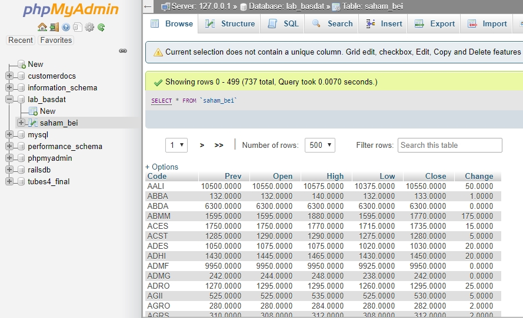

<h1 align="center">
   
  Seleksi 2 Warga Basdat 2019
   
   
</h1>

<h2 align="center">
   
  Data Storing
   
  Muhammad Hendry Prasetya
   
  13517105
</h2>

## DBMS Description

Pada tugas kali ini saya menggunakan DBMS MySQL. Mengapa saya memilih MySQL?
- <b>Mudah Digunakan</b>. MySQL menggunakan query yang umum digunakan dalam bahasa SQL. Query-query tersebut juga telah diajarkan pada mata kuliah Basis Data. 
- <b>Banyak Digunakan</b>. Komunitas-komunitas MySQL sangat besar sehingga kita mudah untuk mencari tutorial atau solusi dari _bug_.
- <b>Banyak _Tools_</b>. Karena MySQL _widely used_ dan telah berkembang sejak 1995, tentunya banyak _tools_ yang dapat membantu menyelesaikan masalah. Selain itu, tools-tools untuk analisis dan visualisasi data (untuk tugas ke depannya) juga banyak tersedia.
- <b>Pemrosesan Query Cepat</b>. MySQL masih populer dengan pemrosesan query yang cepat.
- <b>Tidak _Overkill_</b>. MySQL cocok untuk _simple database setup_.

## Screenshots

Tabel 'saham_bei' pada database 'lab_basdat':

## Reference

Tools digunakan: 
- [Convertcsv](http://convertcsv.com/json-to-csv.htm) (JSON to CSV) 
- [XAMPP](https://www.apachefriends.org/index.html) (Apache, MySQL)

Referensi Bacaan: 
- [DigitalOcean](https://www.digitalocean.com/community/tutorials/sqlite-vs-mysql-vs-postgresql-a-comparison-of-relational-database-management-systems) 
- [Panoply](https://blog.panoply.io/mongodb-and-mysql) 

## Author

- Muhammad Hendry Prasetya, 13517105